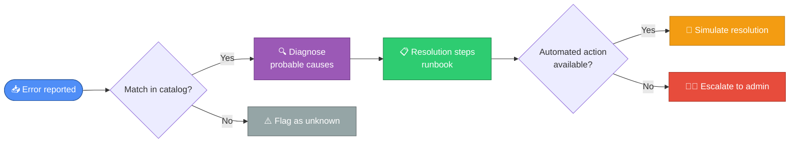

<div align="center">

# 🛠️ SaaS API Error Diagnostic Tool

### Diagnose. Explain. Resolve.

*A command-line troubleshooting assistant for common API errors in Salesforce, HubSpot, and SaaS/CRM integrations.*


</div>

---

## 📑 Table of contents

- [Why this project exists](#why-this-project-exists)
- [What it does](#what-it-does)
- [Tech stack](#tech-stack)
- [Project structure](#project-structure)
- [Getting started](#getting-started)
- [Usage](#usage)
- [How the matching engine works](#how-the-matching-engine-works)
- [Error catalog covered](#error-catalog-covered)
- [Skills demonstrated](#skills-demonstrated)
- [Testing](#testing)
- [Roadmap / Future improvements](#roadmap--future-improvements)
- [About](#about)
- [License](#license)

---

## Why this project exists

Most portfolio projects for support/IT roles stop at "detect the error."
Real technical support work is about **going from a vague error message to a
concrete next action**, fast, under pressure, often while a customer is
waiting. This project is built to demonstrate exactly that loop:

> **Report an error → Diagnose the likely cause → Follow (or simulate) a fix**

It's intentionally simple: no live CRM connection, no database, no
credentials required to run it. Anyone can clone it and see it work in
seconds - which is the point for a portfolio piece a recruiter will actually
open.

<div align="center">

| | |
|---|---|
| 🧩 **Error patterns covered** | 8 (400 · 401 · 403 · 404 · 429 · 500 · 2 sync errors) |
| 🏢 **Systems supported** | Salesforce · HubSpot · Generic REST APIs |
| ✅ **Unit tests** | 12 passing |
| 📦 **Dependencies** | Standard library only (`requests` optional) |
| 🐍 **Python version** | 3.9+ |

</div>

## What it does

- 📥 Takes an HTTP status code, an error message, and an optional source system (Salesforce, HubSpot, etc.)
- 🔍 Matches it against a documented catalog of 8 common SaaS/CRM error patterns, including HubSpot ↔ Salesforce-style **sync errors** (duplicates, field mapping mismatches) that don't map to a clean HTTP code
- 📋 Prints the probable causes and a step-by-step resolution runbook
- 🤖 Optionally **simulates a resolution action**: exponential backoff retry, payload validation, or an OAuth2 token refresh
- 🌐 Bonus: can optionally hit a **real** URL with `requests` and diagnose the actual response it gets back



## Tech stack

- **Python 3.9+**, standard library only for the core engine
- `requests` for the optional live-check bonus feature
- `unittest` for the test suite
- Plain JSON as the data store (no database needed for a project this size - see [Roadmap](#roadmap--future-improvements) for what a production version would add)

## Project structure

```
saas-api-error-diagnostic-tool/
├── README.md                          # This file
├── README.es.md                       # Spanish version
├── LICENSE
├── requirements.txt
├── src/
│   ├── diagnostic_tool.py             # CLI entry point
│   ├── error_catalog.py               # Loads data + matching engine
│   ├── resolvers.py                   # Simulated resolution actions
│   └── live_check.py                  # Optional: real HTTP check via requests
├── data/
│   └── error_catalog.json             # The error knowledge base
├── docs/
│   ├── README.md                      # Runbook index / methodology
│   └── runbook_*.md                   # One detailed runbook per error type
├── examples/
│   └── example_usage.md               # Real captured command output
└── tests/
    └── test_diagnostic_tool.py        # Unit tests (12 tests)
```

## Getting started

```bash
git clone https://github.com/<your-username>/saas-api-error-diagnostic-tool.git
cd saas-api-error-diagnostic-tool

# Optional - only needed for the --live-check bonus feature
pip install -r requirements.txt

# See it work immediately, no arguments needed
python src/diagnostic_tool.py --demo
```

## Usage

```bash
# Diagnose a specific error
python src/diagnostic_tool.py --code 401 --message "Invalid token: session expired" --system Salesforce

# Diagnose AND simulate a resolution attempt
python src/diagnostic_tool.py --code 429 --message "Rate limit exceeded" --system HubSpot --resolve

# Free-text diagnosis, no HTTP code available (e.g. a sync-tool error)
python src/diagnostic_tool.py --message "Duplicate contact record detected during sync"

# Bonus: diagnose a real live HTTP response
python src/diagnostic_tool.py --live-check https://httpstat.us/429 --resolve
```

<details>
<summary><b>📟 See real captured output (click to expand)</b></summary>

```
============================================================
DIAGNOSIS
============================================================
Reported HTTP code : 401
Reported message   : Invalid token: session expired
Source system      : Salesforce
------------------------------------------------------------
Identified error   : Unauthorized - Expired or Invalid Token (ERR-401-TOKEN)
Severity           : HIGH
Match confidence   : 100%

PROBABLE CAUSES:
  1. The access token has expired (OAuth 2.0 access tokens typically expire in 1-2 hours)
  2. The token was revoked manually, or invalidated by a user password change
  3. The refresh token has also expired or was revoked
  4. The integration's credentials (Client ID / Client Secret) are incorrect
  5. A sandbox token is being used against production, or vice versa

RESOLUTION STEPS (runbook):
  1. Check the expiration timestamp of the current access token
  2. Run the OAuth refresh token flow to obtain a new access token
  3. If the refresh token has also failed, re-authenticate with the full OAuth flow
  4. Confirm the integration's credentials have not been rotated or revoked in the admin panel
  5. Verify the request is pointed at the correct environment (sandbox vs production)

Full runbook       : docs/runbook_401_unauthorized.md
============================================================

SIMULATING AUTOMATED RESOLUTION
------------------------------------------------------------
Token refreshed successfully via the OAuth2 refresh_token flow.
New token (simulated): tok_488615_refreshed
------------------------------------------------------------
```

More examples with real output in [`examples/example_usage.md`](examples/example_usage.md).

</details>

## How the matching engine works

No ML, no external NLP library - deliberately, so it's fully explainable in
an interview. `src/error_catalog.py` scores each catalog entry against the
reported error with a simple transparent rule:

| Signal | Points |
|---|---|
| 🎯 HTTP status code matches exactly | **+3** |
| 🔑 Each catalog keyword found in the message | **+2** |
| 🏢 Source system matches | **+1** |

The entry with the highest score wins. This means an error can be correctly
identified purely from its free-text message even with **no** HTTP code at
all - which is exactly what's needed for CRM sync-tool errors that don't
follow standard HTTP semantics.

## Error catalog covered

| Error | Type | Severity | Automated action |
|---|---|:---:|---|
| 400 Bad Request | Validation | 🟡 Low-Medium | Payload validation |
| 401 Unauthorized | Authentication | 🔴 High | Token refresh |
| 403 Forbidden | Authorization | 🟠 Medium-High | Manual (admin) |
| 404 Not Found | Resource | 🟢 Low | Manual (verify) |
| 429 Too Many Requests | Rate limit | 🟡 Medium | Retry with backoff |
| 500 Internal Server Error | Provider-side | 🟡 Medium | Retry with backoff |
| Sync - Duplicate records | Synchronization | 🟡 Medium | Manual (merge) |
| Sync - Field mapping mismatch | Synchronization | 🟠 Medium-High | Manual (config fix) |

Full detail for every error type, including system-specific notes, lives in [`docs/`](docs/).

## Skills demonstrated

This project exists to translate a customer support / IT support background
into evidence a hiring manager for a CRM/SaaS technical role can actually see:

- ✅ **API troubleshooting methodology** - reading HTTP status codes and error bodies, forming a hypothesis, and following a structured resolution path (this is literally what CRM/SaaS technical support does daily)
- ✅ **CRM/SaaS domain knowledge** - Salesforce and HubSpot-specific causes and fixes (OAuth flows, sharing rules, picklists, scopes, sync tooling)
- ✅ **Python scripting with clean structure** - dataclasses, small single-purpose modules, a CLI built with `argparse`
- ✅ **Support documentation / runbook writing** - the same skill used for internal knowledge base articles and customer-facing help docs
- ✅ **Understanding of REST API fundamentals** - status codes, rate limiting, OAuth2 token lifecycle, payload validation
- ✅ **Testing discipline** - a 12-test `unittest` suite covering the matching logic and the resolution simulators
- ✅ **The bridge skill from support to tech** - translating a technical failure into a clear, non-technical explanation and a concrete next step is the same skill used to de-escalate a customer complaint, just aimed at an API response instead of a person

## Testing

```bash
python -m unittest discover -s tests -v
```

## Roadmap / Future improvements

- 📊 **Power BI / dashboard layer**: log every diagnosis to a CSV/SQL table and build a Power BI dashboard showing error frequency by type, by system, and mean time-to-resolution
- 🗄️ **SQL-backed error log**: replace the JSON catalog with a small SQLite database, and add a `logs` table that records every diagnosis run, enabling trend analysis over time
- 🖥️ **Streamlit or Flask front-end**: a minimal web UI so non-technical stakeholders can paste an error and get a diagnosis without the CLI
- 🔗 **Real Salesforce/HubSpot sandbox integration**: an opt-in mode that reads real (sandbox) API errors instead of only simulating them
- 💬 **Slack/Teams bot integration**: post the diagnosis directly into a support channel when an error is reported
- 📚 **Expand the catalog**: add more provider-specific error codes (Zendesk, Intercom, Stripe) as the catalog is data-driven and trivial to extend

## About

Built as a portfolio project to demonstrate API troubleshooting and
resolution skills for CRM Support / SaaS Technical Support / CRM-ERP
Consultant roles, combining a background in customer support and logistics
with IT Support, SQL, Power BI, and API error diagnostics training.

**Contact:** [Daniel Cristians]  · [https://www.linkedin.com/in/daniel-cristians-a4b23b270/]


## License

MIT - see [LICENSE](LICENSE).
